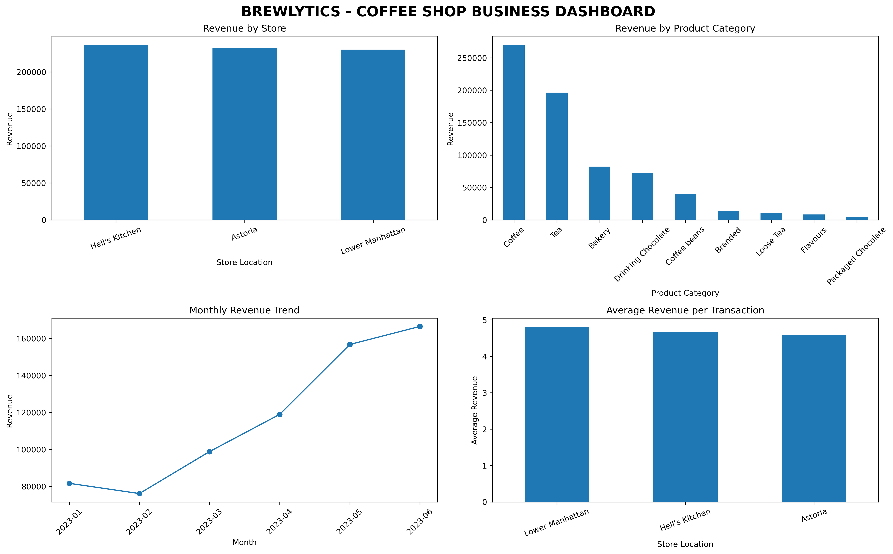

# ☕ Brewlytics — Coffee Shop Sales Analysis

## 📌 Project Overview

Brewlytics is a data analytics project that analyzes coffee shop sales data to understand business performance, customer purchasing patterns, product performance, store performance, and revenue trends.

The project combines Python, SQL, and data visualization techniques to transform raw coffee shop transaction data into meaningful business insights.

---

## 🎯 Objectives

The main objectives of this project are:

- Analyze overall coffee shop sales performance
- Identify the best and worst performing stores
- Identify the best and worst performing product categories
- Analyze top-selling products
- Study monthly revenue trends
- Analyze sales by hour and day of the week
- Compare weekday and weekend performance
- Analyze store and product category performance
- Calculate revenue contribution by category and store
- Identify top-selling products in each store
- Generate business recommendations

---

## 🛠️ Technologies Used

- Python
- Pandas
- NumPy
- Matplotlib
- Seaborn
- Jupyter Notebook
- MySQL
- MySQL Workbench
- SQL
- Git
- GitHub

---

## 📊 Dashboard Preview

The project includes an executive dashboard containing key business performance visualizations.



### Dashboard Includes

- Revenue by Store
- Revenue by Product Category
- Monthly Revenue Trend
- Average Revenue per Transaction

---

## 📂 Project Structure

```text
Brewlytics/
│
├── charts/
│   └── brewlytics_dashboard.png
│
├── data/
│   ├── brewlytics_sales_raw.csv
│   └── raw/
│       └── coffee-shop-sales-revenue.csv
│
├── notebooks/
│   └── Brewlytics_Analysis.ipynb
│
├── sql/
│   └── brewlytics_analysis.sql
│
├── README.md
├── requirements.txt
└── .gitignore
## 📊 Key Insights

- Hell's Kitchen generated the highest store revenue.
- Coffee was the highest-revenue product category.
- Revenue showed an overall increasing trend across the analyzed months.
- Store performance was relatively balanced across locations.
- Sales patterns varied by hour and day of the week.
- Top-selling products and categories can help guide inventory planning.
- Monthly revenue trends can support future staffing and inventory decisions.

## 💡 Business Recommendations

- Maintain sufficient inventory for high-demand products such as coffee.
- Focus promotional efforts on lower-performing product categories.
- Analyze peak sales hours to optimize staff scheduling.
- Use weekday and weekend sales patterns to plan staffing more effectively.
- Monitor monthly revenue trends for inventory and business planning.